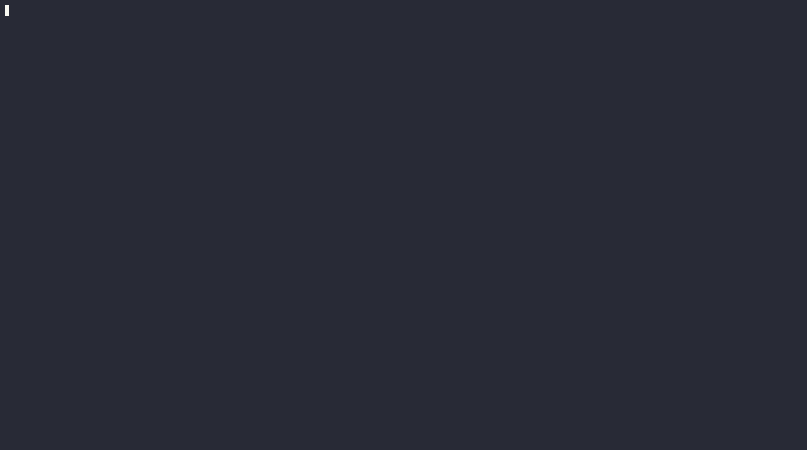

# larprdp

Headless RDP command execution and automation tool

- Execute commands remotely via Windows Run dialog (Win+R)
- Automate keystrokes with DuckyScript payloads
- Capture screenshots to verify execution results
- Authenticate with password or NTLM hash (pass-the-hash)

<p align="center">
  
</p>

## Dependencies

- **FreeRDP 3** libraries + development headers
- **Rust** (edition 2021)

```bash
# Debian/Ubuntu
sudo apt install freerdp3-dev cargo rustc
```

## Build

```bash
cargo build --release
```

## Usage

```bash
# Basic connection check (verifies session, then disconnects)
larprdp 192.168.1.100 user password

# Run a command via Win+R
larprdp --winr "cmd.exe" 192.168.1.100 user password domain

# Execute a DuckyScript payload
larprdp -d examples/revshell.ducky 192.168.1.100 user password

# Pass-the-hash (NTLM hash authentication)
larprdp --pth --winr "cmd" 192.168.1.100 user 31d6cfe0d16ae931b73c59d7e0c089c0

# Take a screenshot after execution
larprdp --winr "powershell.exe" --screenshot shot.bmp 192.168.1.100 user pass
```

### Options

| Flag | Description |
|------|-------------|
| `--pth` | NTLM pass-the-hash authentication |
| `-w, --wait <sec>` | Wait before actions (default: 10s) |
| `-d, --duckyscript <file>` | Execute DuckyScript payload |
| `--winr <string>` | Type string via Win+R Run dialog |
| `--screenshot <file>` | Save BMP screenshot |
| `--screenshot-delay <sec>` | Extra delay before screenshot (default: 5s) |

## License

AGPLv3 - see [LICENSE](LICENSE).
